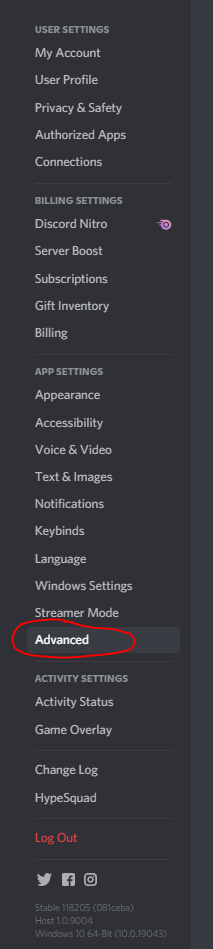

# 🐛 Debuging

## Developer mode

Discord has a custom setting for developers. However this can also be super useful for moderation purposes. We have a variety of different commands which take in userIDs or messageIDs as a command parameter.

.png>)

.png>)

