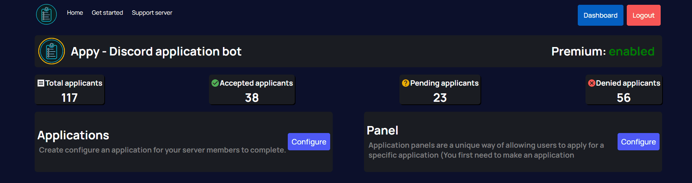
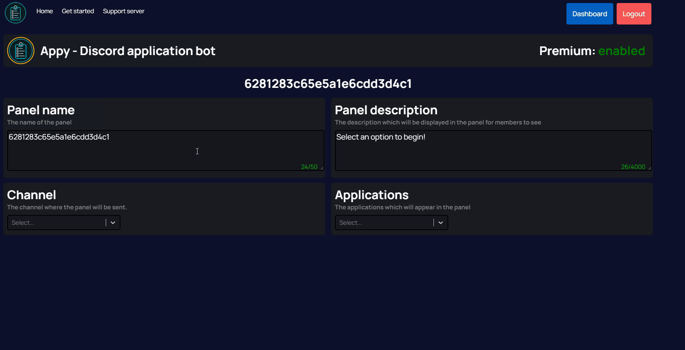

# 📃 FAQ

## What is the prefix for Appy?

Appy's prefix is / . You can type /help for a list of commands.

## How do I create an application?

To create an application you first need to visit and login to our [interactive web dashboard](https://appybot.xyz/dashboard). Once you have logged in you will see a list of servers, you will need to select the server you wish to configure.

You will then be navigated to the screen below, follow the video to begin.

## How to create an application panel

To create an application panel you first need to visit and login to our [interactive web dashboard](https://appybot.xyz/dashboard). Once you have logged in you will see a list of servers, you will need to select the server you wish to configure.

You will then be navigated to the screen below, follow the video to begin.

You can then fill out the required settings. Once done, a save box will appear. To send the panel in your selected channel simply click `save`&#x20;

